## Please use at your own risk. This is a submission for bounty, not production/battle-tested and audited software.

<br>
<br>

# **DemocraDot**

<br>

## Table of Contents

1. [General Info TL;DR](#general-info)
2. [Installation](#installation)
3. [Mobile Dapp ](#mobile-dapp)
4. [Demo Videos](#demo-video)
5. [Infrastructure](#infrastructure)
   - [SubQuery Project MoonbaseAlphaGov](#subquery-project-moonbasealphagov)
   - [Entity54 Broadcasting Channels Manager](#entity54-broadcasting-channels-manager)
   - [Governance Broadcasting Channel Manager](#governance-broadcasting-channel-manager)
6. [ToDos](#todos)
7. [End thoughts](#end-thoughts)

<br>

## General Info

---

<p>Decentralised governance is a essential part of the ecosystem. It empowers the community with the right to dictate the speed and direction with which an ecosystem involves. 
<br><br>
With the above in mind it is evident that more users must participate in governance either directly or via delegation with decentralised identities for the system to reach its full potential. When measuring governance participation, some key performance indicators (KPIs) are directly correlated to the mediums used to read and vote on a referendum. It is also important to analyze in plain terms the encoded data of a referendum hash and its consequences.
<br><br>
Almost everybody has a mobile device which they mostly carry with them at all time. 
<br>
It is therefore evident that a mobile app will bridge the accessibily vaccum and allow web3 to reach end user adoption in a natural way.
<br><br>
This repo contains an Expo Managed Mobile App that allows the user to read active MoonbaseAlpha referenda, vote and unvote with an amount of DEV tokens and conviction using their MetaMask account. 
<br>
We have used an industry standard framework https://expo.dev/ which allows the mobile development to be compatible on both Android and iOS mobile devices. The framework permits showcasing the Mobile Dapp without having to publish to the Google Play and/or Apple App stores which demand a longer approval timeframe procedure. 
</p>

<br>

### **Important Notes**

---

<br>
For the Mobile Dapp to work the following prerequisites are needed:

1. Install MetaMask Mobile App in your device <br><a href="https://play.google.com/store/apps/details?id=io.metamask&hl=en&gl=US" target="_blank">Play Store</a> / <a href="https://apps.apple.com/us/app/metamask-blockchain-wallet/id1438144202" target="_blank">App Store</a>
2. Connect your MetaMask Mobile App to MoonbaseAlpha, create an account and finance it with some DEV tokens from the faucet:<br> https://apps.moonbeam.network/moonbase-alpha/faucet/
3. Install the Expo Go App on your mobile device: <br>https://play.google.com/store/apps/details?id=host.exp.exponent <br>https://apps.apple.com/us/app/expo-go/id982107779
   <br>

<br>
<br>

### Installation

---

Base installations that also allow development:

```bash
$ brew install node
$ brew install watchman
$ npm install -g expo-cli
```

Create a new folder and inside it:

```bash
$ git clone https://github.com/Entity54/Mobile-Governace-MoonbaseAlpha
$ yarn install
$ expo start
$ scan QR code
```

> Note: We are using WalletConnect to connect our mobile Dapp with MetaMask Mobile App without ejecting.

<br>
<br>

### Mobile Dapp

---

<p>
STEP 1 - Open your mobile phone and ensure that Expo Go and MetaMask Apps are installed.
<br>

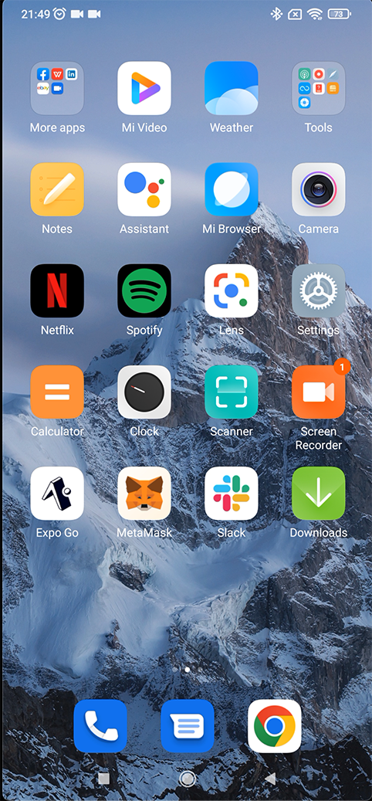

</p>

<br>
<br>

<p>
STEP 2 - Open the Expo Go App.
<br>

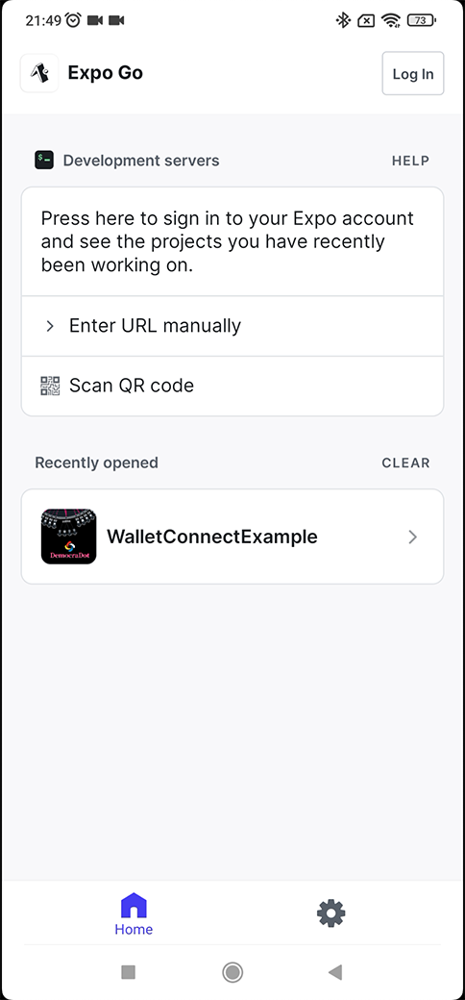

</p>

<br>
<br>

<p>
STEP 3 - Scan the Expo produced QR Code. <br>
Make sure that your mobile phone is connected to the internet and on the same network as your PC.
<br>

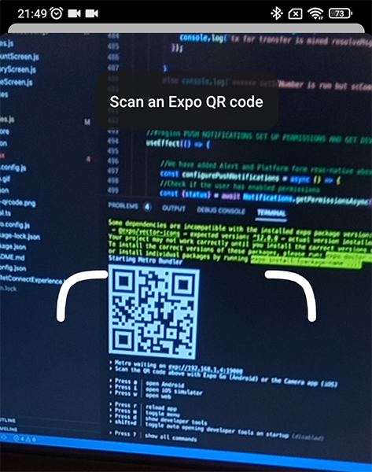

</p>

<br>
<br>

<p>
STEP 4 - Wait for the Splash screen to finish loading the Mobile Dapp. <br>

<br>

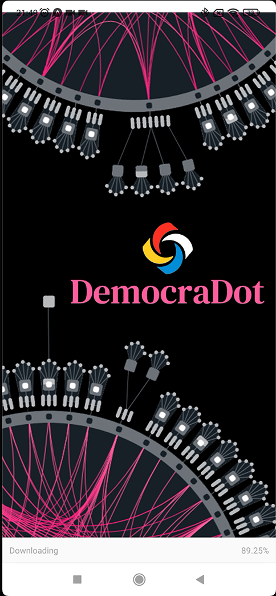

</p>

<br>
<br>

<p>
STEP 5 - The Dapp starts querying our SubQuery Project and the Referenda screen loads displaying the active Referenda. <br>
Notice that we are not connected to a wallet yet.
<br>

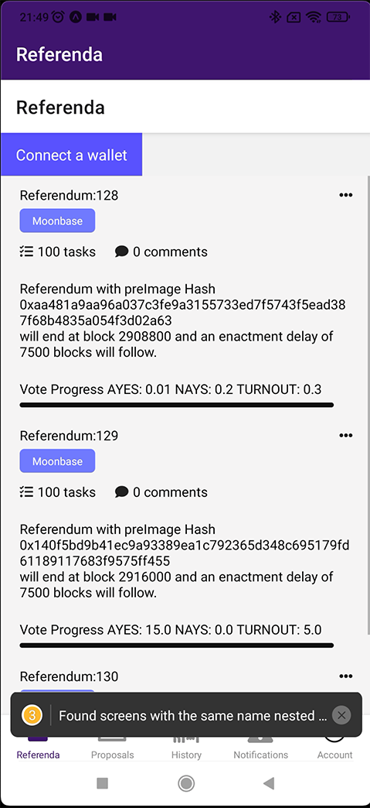

</p>

<br>
<br>

<p>
STEP 6 - Connect MetaMask Wallet to the Mobile Dapp. <br>
Please ensure you have some DEV tokens in the account for the next steps.
<br>

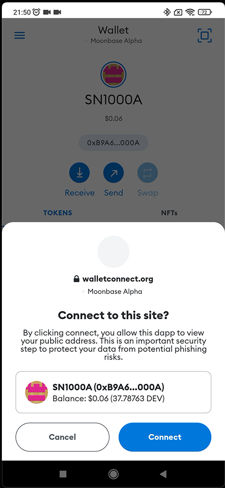

</p>

<br>
<br>

<p>
STEP 7 - MetaMask account is now connected to the mobile Dapp. We can now sign and send transactions.
<br>

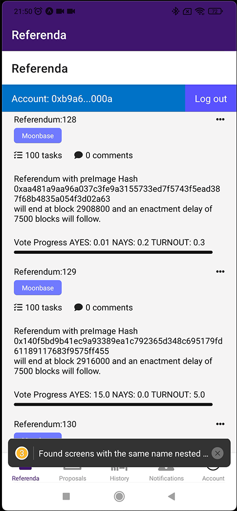

</p>

<br>
<br>

<p>
STEP 8 - Tap on the desired referendum and see referendum screen with referendum details and buttons actions  <br>

<br>

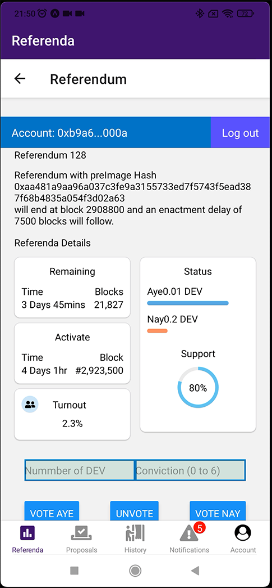

</p>

<br>
<br>

<p>
STEP 9 - Fill in number of DEV tokens you wish to use for your vote (for example 1) and set the desired conviction to 1 (1 Day lock). <br>Tap VOTE AYE. <br>

<br>

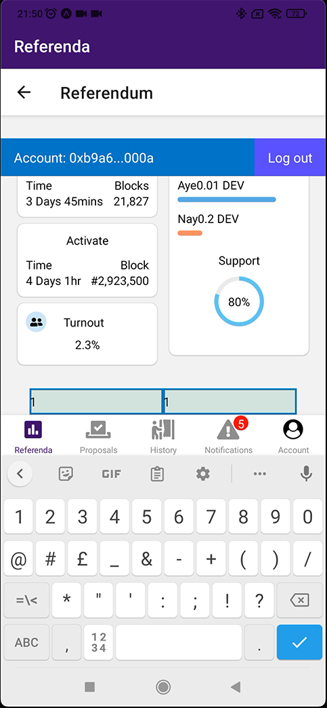

</p>

<br>
<br>

<p>
STEP 10 - MetaMask pops up and prompts you to sign and send the transaction to Vote Aye with 1 DEV and Conviction 1.  <br>
Soon after we are returned autmatically to our origin Mobile Dapp.
<br>

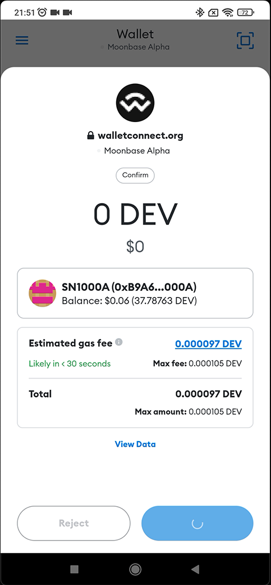

</p>

<br>
<br>

<p>
STEP 11 - Once we return automatically to our Mobile Dapp we can see after the transaction is mined and indexed by our SubQuery Project the referendum results are updated. The "AYES" now have a total of 1.01 DEV.  <br>
Note: In our example the account had previously voted NAY so by voting AYE the token were removed and increased from 0.2 to 1. The update shows 1 DEV token more on the AYES and 0 on the NAYS.
<br>

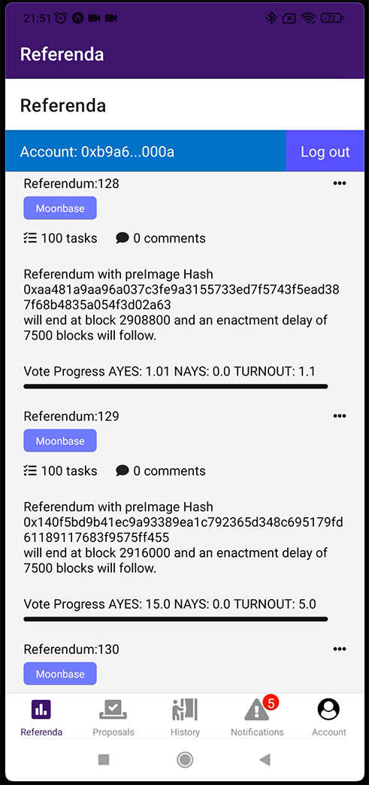

</p>

<br>
<br>

### Demo Video

---

<p> A demo video of the mobile Dapp can be found <a href="https://youtu.be/yQklPZdsCng" target="_blank">here.</a>

</p>
<br>
 
<br>

### Infrastructure

---

<p>
The Mobile Dapp is only one part of the current infrastructure we are building. <br>
The design of the infrastructure in its current form is assembled by several parts: <br>

<br>

1. Mobile Dapp (this repo and instructions above)
2. SubQuery Project MoonbaseAlphaGov
3. Entity54 Broadcasting Channels Manager
4. Governance Broadcasting Channel Manager

<br>

<br>

### SubQuery Project MoonbaseAlphaGov

<br> 
<p>
Github Repo: <a href="https://github.com/Entity54/SubQueryMoonbaseAlpaGov54" target="_blank">MoonbaseAlphaGov Github Repo</a> <br>
Online access at: <a href=" https://explorer.subquery.network/subquery/Entity54/MoonbaseAlphaGov" target="_blank">MoonbaseAlphaGov at SubQuery Explorer</a>
<br>
The role of the SubQuery Project is to index all relevant events, extrinsics and system events that are needed to trigger Push Notifications as we shall see further down. 
<br>
In addition it is known <a href="https://polkadot.js.org/docs/util-crypto/FAQ#my-react-native-build-runs-out-of-memory" target="_blank">here</a>
that in its current form Polkadot API is "heavy" for mobile usage. <br>
We deemed it most appropriate to utilise the powerful and (soon to be decentralised) SubQuery technology. This lead us to write extra code inside our SubQuery Project so we can always have ready and available the latest list of Referenda and Proposals with their respective details.
<br>Finally this SubQuery Project will be used in future versions for populating the History section in the Mobile Dapp screen, whereby the user will be able to see all of their voting history.
</p>
<br>
<br>

### Entity54 Broadcasting Channels Manager

<br> 
<p>
The Entity54 Broadcasting Channels Manager is a webserver to be deployed in AWS and it has its dedicated repo at:<br> 
<a href="https://github.com/Entity54/Governance-MoonbaseAlpha-Clent-Manager-Servers" target="_blank"> Entity54 Broadcasting Channels Manager & Governance Broadcasting Channel Manager Repo</a><br>
This repo also hosts the 
Governance Broadcasting Channel Manager as we shall soon visit. A full ReadMe will be dedicated in the respective repo. Here we will provide a brief summary description:
<br>
The Entity54 Broadcasting Channels Manager implements at the moment a network of one smart contract (ABI of which also exists in the Mobile Dapp and this repo) and a webserver with its own interface located in AWS and soon to be decentralised.
<br>
The purpose of the smart contract is to offer the functionality of creating or deleting communication channels and passing the administration of an existing channel, to allow a user to register their unique mobile device token and then subscribe to any channel.<br>
Furthermore, the smart contract keeps track of the unique file id that contains any pending notifications due to be delivered to channel subscribers.

> Note: When a mobile user registers their unique mobile device tokens, they will be stored in an encrypted form. Only the Entity54 Boradcasting Channels Manager has the ability to decrypt those tokens.

<br>Finally the Entity54 Broadcasting Channels Manager is repsonsible to PUSH any pending notifications to the relevant channel subscribers and ensure that these are cleared from the smart contract memory, so they are not resent multiple times.

</p>
<br> 
<br>

### Governance Broadcasting Channel Manager

<br> 
<p>
The Governance Broadcasting Channel Manager shares the same repo with the Entity54 Broadcasting Channels Manager so here we will provide a brief summary:
<br>
Lets assume you wanted to create a decentralised channel of communication (we often see this as a tv channel broadcasting with a subscription).
<br>
Firstly the smart contract can be used to establish such a channel providing a name, in our case here, "Governance Broadcasting Channel", ticker ( GBC ), along with the administrator of the channel who has several powers, for example managing the state of the channel.
<br> 
As with any channel, this can accept subscribers.<br><br>
In our case here a user firstly registers from their mobile phone from the Account Screen by writing the encrypted with aes-256-cbc algorithm version of their mobile token on our smart contract and then choosing to subscribe to the Governance Broadcasting Channel.
<br>

> NOTE: We have tested the infrastructure by registering our encrypted Mobile Devices tokens (iphone and Android) via Remix and we can see the PUSH notifications generated. However due to unanticipated issues and delays beyond our control it became impossible to provide this functionality in the Account Mobile Dapp screen demo, although evidence of preparing for it exist.

<br>
Governance Broadcasting Channel Manager is responsible for periodically quering our SubQuery project and as soon as it detects that a new event e.g. a new Vote/Endorsement, a new extrisnic such as Unlock or RemoveVote or a system event like Proposal Tables, Referendum Passed/NotPassed, Referendum Executed, it prepares the payloads of the necessary PUSH notifications, and saves these in a file with a unique identifier.
<br>

> NOTE: In the current form the PUSH notification files are saved on desktop and soon on AWS connected drives. In a future version this files will be stored on IPFS and the currently created via UUID module unique file identifier will be replaced by the IPFS provided one.<br>
> Hackathon time limit contraints only permit us to show a proof of concept.

<br>
With Entity54 Broadcasting Channels Manager and Governance Broadcasting Channel Manager having access to the same files that store notifications the design is now straightforward. 
<br>Governance Broadcasting Channel Manager, an entity on its own, picks up on every block any relevant information and processes this to form PUSH notification payloads e.g. title, body (soon metadata) and stores in one file. Meanwhile the Entity54 Broadcasting Channels Manager reads on every block the smart contract all evailable channels for any pending notifications, if found any it sends the PUSH notifications to the channel subscribers and ensures that it deletes these from the smart contract to avoid repetition.
<br> 
<br>

> Note: Both Entity54 Broadcasting Channels Manager and Governance Broadcasting Channel Manager webservers offer their own basic administrator monitoring front ends.
> <br>For Governance Broadcasting Channel Manager the channel information is shown along with the subscribers ethereum addresses (but not the encrypted mobile device tokens of its subscribers) and the list of PUSH notifications and their payloads, pending for delivery.
> <br>For the Entity54 Broadcasting Channels Manager we can see the channel specifications and its subscribers, along with their encrypted mobile device tokens and payloads of all notifications sent.

</p>

<br>

Example: Subscribers encrypted mobile token read by Entity54 Broadcasting Channels Manager from smart contract:
<br>

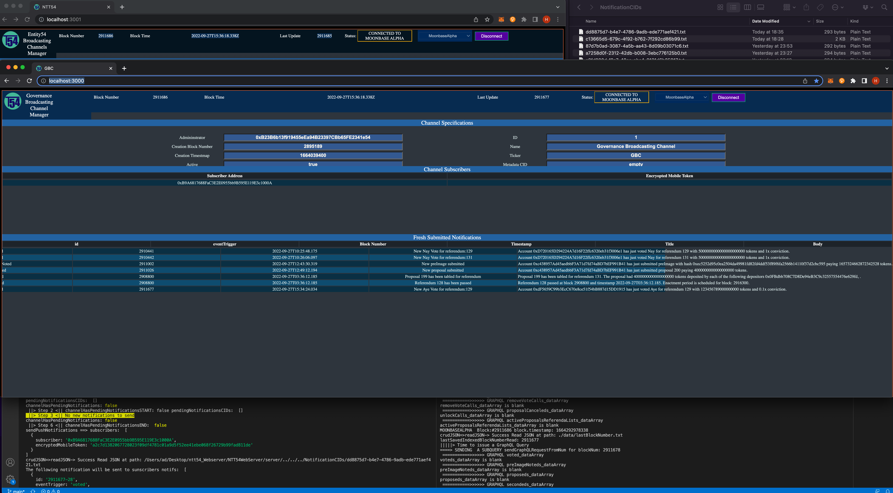

<br>
<br>

Example: Push notification sent to the channel subscribers:
<br>

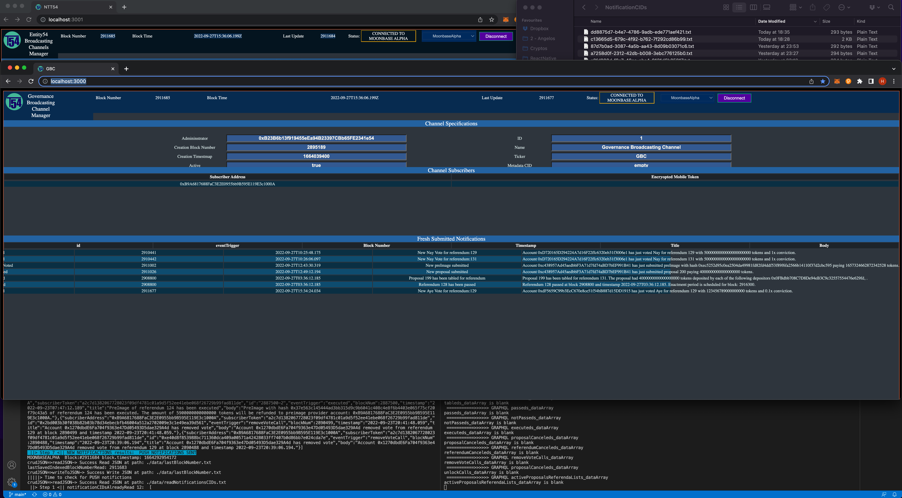

<br> 
<br>

### ToDos

<br>
In the coming weeks we will be finalizing the implementation of our mobile app, allowing the user to register for notifications and retrieve their historical voting behaviour.<br> 
Also included will be more advance alerts for scheduled notifications.
<br>

<br> 
<br>

### End thoughts

<br>
In our view mobile devices will play a crucial role in web3 adoption.<br> 
Technology that allows access to instant, actionable events will be the key to this adoption and areas such as Governance will be the initial beneficiaries.
